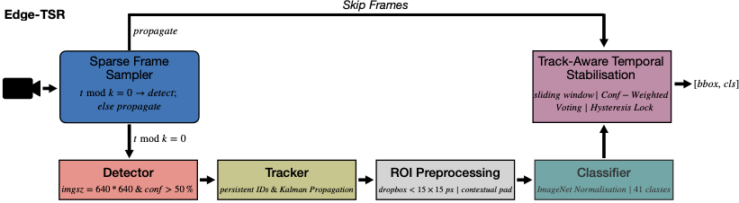
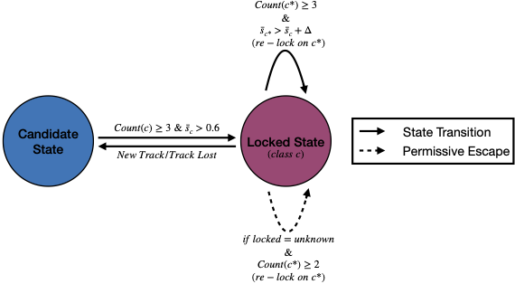

# Edge-TSR
> Beyond Benchmarks: Continuous Edge Inference for Fine-Grained Roadside Perception

## Introduction
> Continuous AI inference on resource-constrained edge hardware introduces deployment effects that are largely invisible to conventional benchmark evaluation, including temporal instability in streaming video, thermal throttling under sustained load, and workload-dependent performance variability. We present "Edge-TSR", a deployment-oriented continuous edge inference system for sustained roadside perception on the NVIDIA Jetson Orin Nano. Edge-TSR integrates detection, tracking, fine-grained classification, and a lightweight track-aware temporal stabilization mechanism that improves streaming inference consistency with negligible computational overhead. Our central finding is that benchmark-centric evaluation systematically overstates deployed edge inference performance. Across three state-of-the-art baselines, we observe consistent 20-30% relative degradation when transitioning from static-image evaluation to real-world streaming deployment. Edge-TSR addresses this gap through temporal inference stabilization, recovering up to 10.16% classification accuracy over per-frame inference baselines while maintaining sustained real-time performance under continuous operation. We evaluate the complete system under diverse real-world deployment conditions, jointly characterizing inference quality, latency, throughput, and thermal behavior during long-duration operation. A 55-minute vehicular deployment over a 26~km route demonstrates sustained operation at 16.18 FPS within safe thermal limits on a single embedded device without cloud offload. Our findings show that deployment-aware evaluation and temporal inference stabilization are necessary components of continuously operating edge AI systems intended for real-world sensing deployments. We release a sample annotated streaming video evaluation dataset and full system implementation to support reproducible deployment-centric evaluation.

## Evaluation Dataset
One video fromt the evaluation set has been released for the review purpose. The folder contains the "rain.mp4" and "rain.xml". The full evaluation set will be released soon. | [Evaluation Subset](https://drive.google.com/drive/folders/1mRsVSxDiLbAXiVb5VDHgT5RWxJtnrOVz?usp=share_link)

## Model Architecture

> Overview of the Edge-TSR continuous edge inference system. Detection is performed every "k" frames, with tracking-based state propagation on intermediate frames. A track-aware temporal stabilization layer combines classification outputs through confidence-weighted voting and hysteresis to produce temporally stable outputs (bbox, cls). 

## Hysteresis Based Locking Mechanism

> State machine of the track-aware temporal stabilization layer. Tracks transition from a "Candidate" state to a "Locked" state based on confidence and temporal consistency. Locked labels are retained across frames and updated only when sufficient contradictory evidence is observed.

## Requirements
Use the `requirements.txt` file to install all the necessary libraries. Execute the following command:

```bash
pip install -r requirements.txt
```

## Reproducing Training Results
- To run the Edge-TSR model run the following two commands simultaneously:

```bash
python gpu_stats.py 
```
```bash
python edge_tsr.py 
```
## Running the Evaluation Script
- To evaluate Edge-TSR model run the following command::

```bash
python eval.py --pred_path [predictions_path] --xml_path [annotations_path] --eval_frames_path [evaluated_frames_path]
```
- To get the consistency score run the following command::

```bash
python consistency_score.py --pred_path [predictions_path]
```


